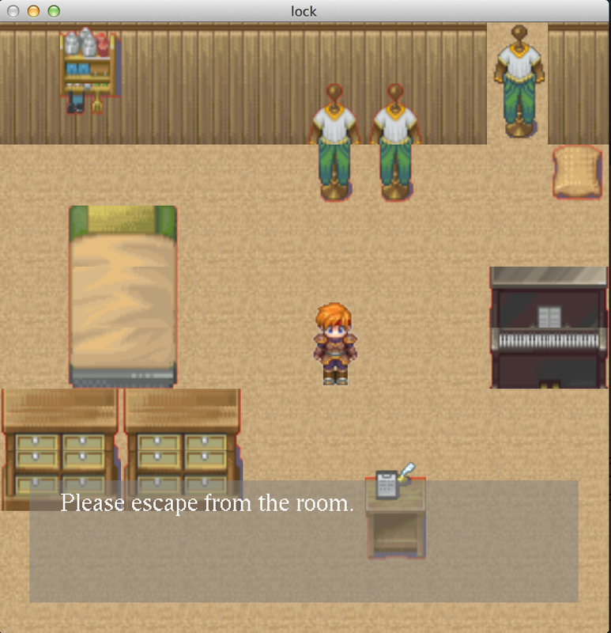

# CRPG 第二階段完成

第二階段主要是把功能補到可以讓一個小小的遊戲運行。終於告一段落了（癱

文件神馬的就先等最後階段吧（滾（被揍

## 小小的遊戲

目前只能在mac上編譯。

玩具當然先拿出來，不過這版本是**Unstable**的，修改著玩是可以的，不過可別認真修改這貨，要執行的話要`cd`到該資料夾，然後`$ ./lock`

[Game : Lock](https://www.mediafire.com/folder/i9a4ved645ovi/Lock)



## 過程

在第二階段，碰到了一些有趣的事情，值得記錄一下

### OpenAL

遊戲怎麼能缺少聲音呢，有OpenGL怎能沒有OpenAL呢(笑

OpenAL 簡易教學

### Python API Interpreter not thread safe

老實說，一開始在code時沒注意到，在第二階段才發現，最後，我用`std::mutex`和Python提供操縱多Interpreter的API解決了，主要是用mutex使得當前Interpreter只有一個事件在做，當這個事件進入IO waiting時，把狀態存下，Lock釋出，等重新獲得Lock時，再把狀態塞回去。

* [std::mutex](http://en.cppreference.com/w/cpp/thread/mutex)
* [Initialization, Finalization, and Threads](https://docs.python.org/2/c-api/init.html)

## PNG Loader

找到了一個不錯的c++ PNG Loader:

* [LodePNG](http://lodev.org/lodepng/)

### 把scene從env裡面移除

一直覺得env實在有點髒，裡面有各種東西。

於是之後我在Scene class裡面改了：

```cpp
class Scene{
public:
    //...
    static Scene* scene_now;
    //...
};
```

其他的Scene子類型也增個instance，這樣增修後，更改scene的code簡潔許多。

### WindowBlockType

我把會占用Input的Window另外分了一類，並且把資源控制權交給各個instance，這樣合理多了。

```cpp
class WindowBlockType{
public:
    static WindowBlockType* msg;
};
```

在instance裡面要結束時，直接：

```cpp
WindowBlockType::msg = nullptr;
delete this;
```

## 第二階段沒解決的

[crpg : Issues](https://github.com/mudream4869/crpg/issues)

### 跨到Windows

下一階段會完成的！crpg最初的希望． :)

### 良好的資源控制

### 很多Instance可能不**Thread Safe**

### 紅線問題

很想知道到底是怎麼回事＠＠

### OpenGL中文字

這一直是一個麻煩的東西，我暫時不會把他列在**crpg1.0**的目標裡面。

### 事件當前狀態取得和設定

總覺的這恐怕無法以正常手段達成。