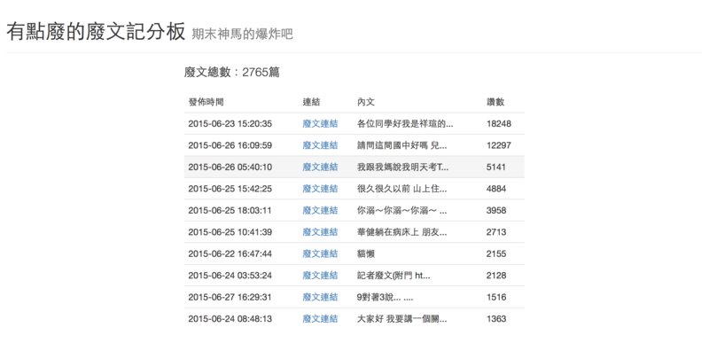

# 期末廢文大賽排行榜製作

## 原因

一開始是在期末窮極無聊的時候發起了一個活動[期末廢文大賽](https://www.facebook.com/events/832004440226215/)，然後四五天過後，發文人數意外的多，還有幾篇讚數也快突破天際了 ~~看來大家的期末都好崩潰~~ ，就有點好奇哪些貼文讚數前十名。

## 實作

基本上，主要是使用[Facebook Graph API](https://developers.facebook.com/docs/graph-api)，需要和Facebook申請成為Developer後，再申請一個App(這樣就可以獲得操作API的**access\_token**)

拿到操作API的Token後，試了一下抓取活動貼文的API，大概可以發現：

* 每次回傳十個貼文的相關資訊和**下一頁**
* 貼文的相關資訊不包含讚數（需要自行抓取）
* 一頁的貼文數量雖然可以調整，但不能太多

所以就必須分批抓取，並且讚數也要額外抓取。實際弄一弄會發現每次更新記分板總共至少超過5分鐘，所以Server這樣是設計的:：首先寫一個可以自動生成靜態網頁排行榜的`Python`腳本，然後讓系統每固定時間去執行即可。

### 固定執行

Linux提供了一個很方便的排程系統`Crontab`，只要指定好觸發規律（可能每天哪個時段或每小時哪些分鐘之類，總之很方便。）和執行指令，就好了。

### 腳本

用到Python的`Request`和`Tornado`。

* 不斷地抓取貼文，直到沒有下一頁：

```python
it_url = 貼文API
while(1):
    obj = json.loads(requests.get(it_url).text)
    for row in obj["data"]:
        '''
        貼文ID : row["id"]
        貼文時間 : row["created_time"]
        貼文內容 : row["message"]
        '''
        pass

    if "paging" not in obj: break
    if "next" not in obj["paging"]: break
    it_url = obj["paging"]["next"]
```

* 抓取讚數：

需要貼文的ID，然後因為一些特殊貼文似乎沒有summary，所以擋一下Exception

```python
base_url = "https://graph.facebook.com/v2.3/"
def get_like_count(id):
    get_obj = json.loads(requests.get(base_url + id + "/likes?summary=true&" + access_token).text)
    try:
        return get_obj["summary"]["total_count"]
    except:
        return 0
```

然後網頁主要是用`Tornado`的Template生成來做到，這裏就不特別說明。

生成網頁的長這樣(2015/08/09抓的)



### 完整Code

[期末廢文大賽記分板Gist](https://gist.github.com/mudream4869/b1a143d6c14f27cfd642)

## 正確性

因為並不是一次就把所有發文都抓到手，且每篇的讚數都是分別抓取，所以抓取的讚數會有點不正確。不過，實際上，在前十名的排名基本上不會有影響，因為前十名差距基本上都是百位起跳，所以排名是不會有影響的。

## 後記

之後有為了另一個活動改成每半小時蒐集資料塞到一個資料庫，提供按照內文或貼文使用者搜尋的功能。手段大同小異，就不贅述。