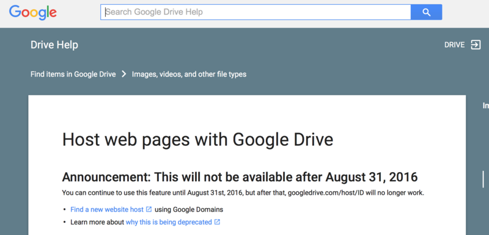

# 單本小說頁面 (2)

恩 標題我也不知道要怎麼取了，總之就是在用的時候發現一開始寫的太過陽春，所以加上一些新的東西。

## 假如有檔名是xxx.md並且list裡面也有把md副檔名加進去，那就用showdown解析

這功能我糾結了很久，其實原本是我想把這拿來寫筆記時出現的，可寫筆記......Hackpad就很夠用拉，這裡似乎也沒必要增加markdown，不過後來想到，可能會需要放圖片，像是主角圖之類的，所以最後決定加上會解析markdown的功能。

其實我也沒花多少時間search，之前我有想用github io弄一個blog，把**偽pjax**、markdown、highlight都用進去，可是不怎麼好看，所以也暫時棄置，留下的大概就是弄**偽pjax**和markdown的經驗值。

[Showdown](https://github.com/showdownjs/showdown)的用法如下：

* 引用

```
https://cdn.rawgit.com/showdownjs/showdown/<version tag>/dist/showdown.min.js
```

* 建立converter+Convert

```javascript
var converter = new showdown.Converter(),
	text      = '#hello, markdown!',
	html      = converter.makeHtml(text);
```

## Droppages `Public`資料夾底下`.md`不在Valid File Extension List裡面

阿，當初也不知道為什麼在這裡糾結許久，改成`.md.txt`就好了，這絕對不是我鑽牛角尖啊，絕對不是！

[Droppages : Static content](http://droppages.com/getting+started/static+content)

## Google doc host web page功能在2016年八月底後失效

實驗完Droppages後，就想起Google硬碟好像有提供類似的服務，可仔細一查，發現了這件讓人難過的事情。



## KeyBroad左移右移鍵

這原本就要做的，只是一開始只是先把必要的弄出來，主要Code如下：

```javascript
$(document).keydown(function(down_event){
	var keycode = down_event["keyCode"];
	if(keycode == 37){
		//左移
	}else if(keycode == 39){
		//右移
	}
});
```

## 判斷是否有提供txt來生成下載txt的按鈕

errrr... 到時可能還會追加個小tool會自動把所有章節抓起來弄成txt吧，不過現在先這樣？

```javascript
$.ajax({url:"txtall.txt", type:'HEAD', success: function(){
	$("div.cont").append('<a href="txtall.txt" class="btn btn-primary">下載TXT</a>');
}});
```