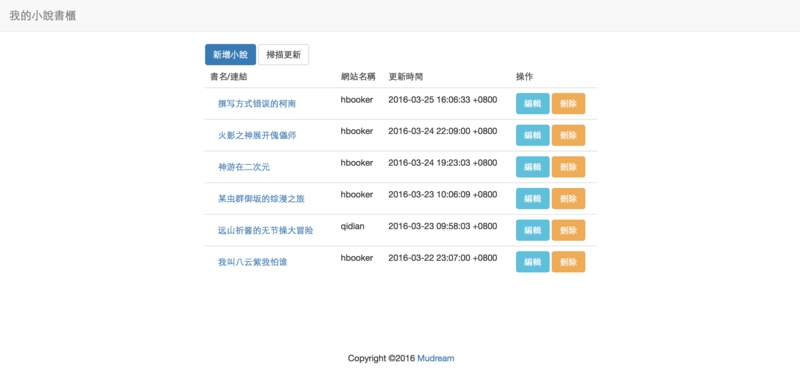

# ROR的第一次

認真講，這不是第一次用ror，去年就有弄過，
只是那時候太猴急，想直接從使用者登入開始做，這簡直作死阿QQ

總之，最近突然想架一個負責偵測小說有沒有更新的app，
原本想用老方法python-tornado + beautifulsoup弄一弄，
但突然想起去年沒有徹底去學ror，所以就先用ror啦！

## 基礎

生成project:

```
$ rails new [專案名稱]
$ cd [專案名稱]
$ bundle install
```

## 測試：

```
$ bin/rails server
```

## Controller (ROR有個像MVC的架構)

* 生出 Controller

```
$ bin/rails generate controller [Controller名稱]
```

如此，會在app/controller/底下生出一個`[Controller]\_controller.rb`，裡面會有

```
class [首字大寫的Controller名稱]Controller < ApplicationController
end
```

有時需要調整一下configs/route.rb裡面的path

## Model

像是資料庫的東西，要加一個新的Model，要

```
$ rails g model [Model名稱] [欄位1名稱]:[欄位1型態] ...
```

然後

```
$ bin/rake db:migrate
```

才可以把新的資料庫處理好，新的資料庫名稱會是[Model名稱、首字大寫]

路由可以加

```
match ':controller(/:action(/:id(.:format)))', :via => :all
```

## 額外的東西

Bootstrap和Bootstrap-Model需要用 gem + bundle install裝上去

* Ajax可以這樣做

```
<%= link_to 'Hello!', ... , :id => "btn-click"  %>    
<script>
$(document).ready(function() {
    $('#btn-click).click( function(){
        // Deal with $(this).attr("href");

        return false;
    });
});
</script>
```

* 抓取網頁可以用這種方法

```
require 'open-uri'                                        
require 'nokogiri'
doc = Nokogiri::HTML(open(url))
return doc.css('a').length.to_s
```

nokogiri有beautiful soup的功用。

## 成果

最後就弄出這樣的東西了呢



主要做了起點和hbooker的監測。
