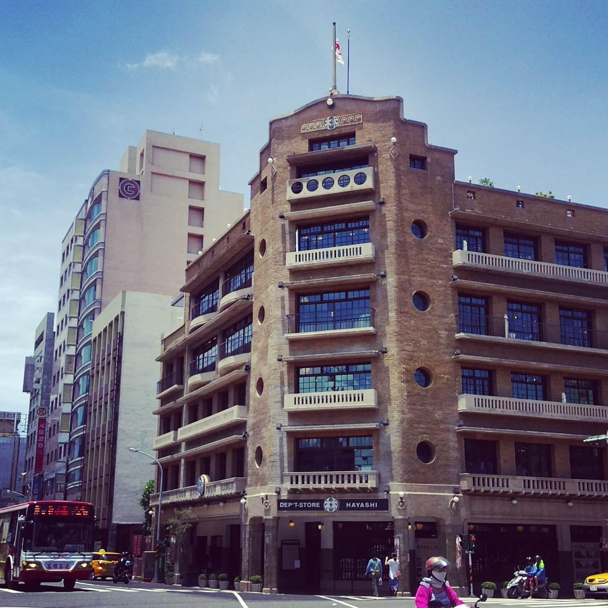
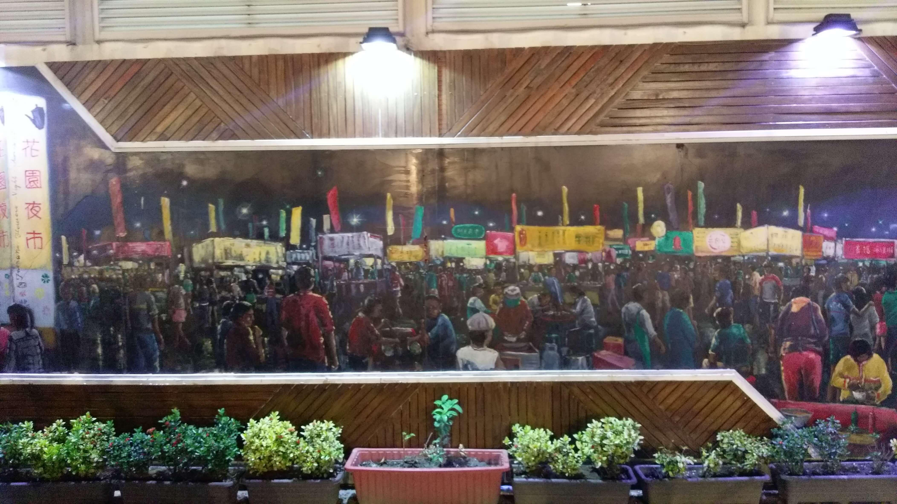
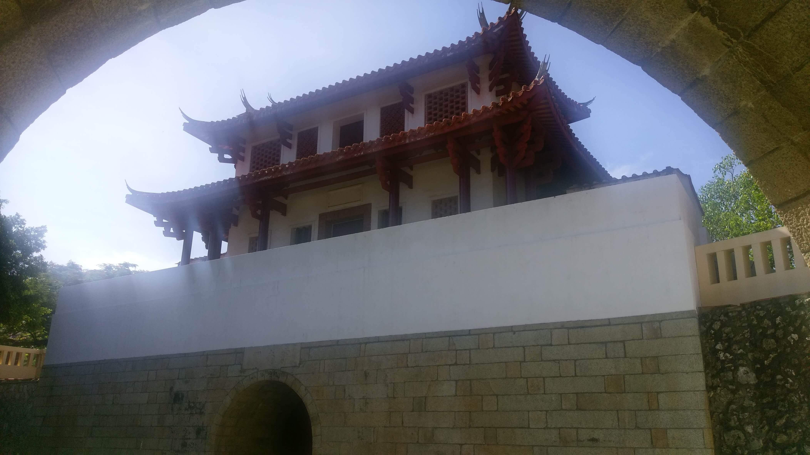
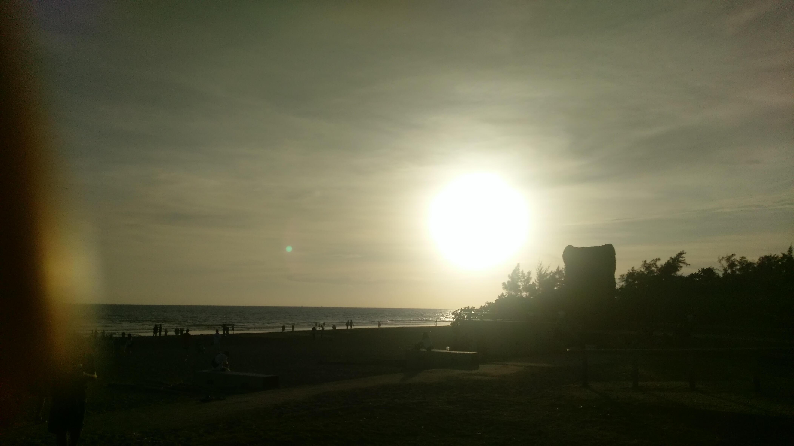
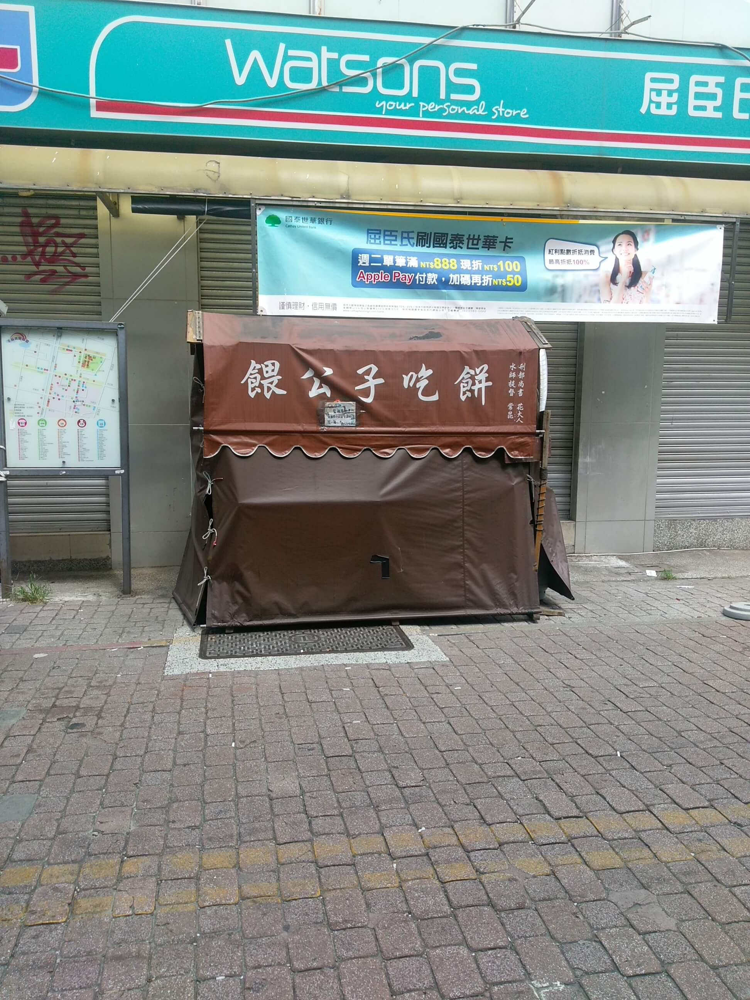
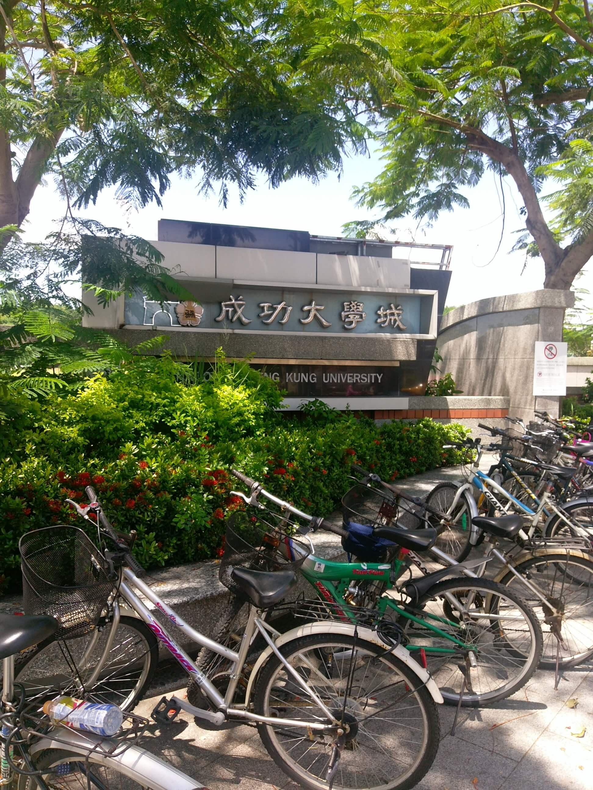

# 台南吃三天

期末挖出了三天和老媽一起到台南旅遊，並沒有特別設計什麼行程，總之就是待在台南三天，吃遍➕玩遍台南。

我媽很喜歡到處去吃些小吃，不過並不是大吃特吃的那種。她通常只需要償味道，再加上一定的量，所以會需要我和她一起分食。

## 第一天

### 赤崁樓

若不算上台南火車站，到台南的第一個逛的古蹟便是赤崁樓。印象中以前也有來過至少兩次，這次就算是第三次了。

午餐是在赤崁樓附近解決，吃一個擔仔麵和蝦仁飯，蝦仁飯還好，擔仔麵還不錯。

### 林百貨

一個在日治時期的百貨，三年前又開始營業，裡面還有展覽那時候的「電梯」。

### 花園夜市

刻意在六點左右（一個不會有很多人的時候）就來，逛了一圈人才漸漸開始變多。

## 第二天

我們住在某賣鹹粥的附近，早餐當然就是吃鹹粥囉。

### 四草紅樹林綠色隧道

### 孔子廟

在孔子廟附近還有一個小學，外型滿神奇的，有種書院的感覺。

### 大南城門

### 觀夕平台

四處看看，兩人一組的大概都是情侶，有一部份大概是同學朋友揪團，一部分是家庭？

來這裡看夕陽的同時，我的心靈也受到超有效的傷害。

### 大東夜市

在觀夕平台附近的公車剛好有經過大東夜市，所以晚餐跑到那裡解決。

## 第三天

早上在住宿附近亂逛。

### Dr. Pepper

這不算是台南特產，不過這還是我第一次喝，就先做個紀錄，不論是櫻桃口味還是原味，都有種櫻桃的味道。

### 魚皮粥

滿好吃的，前幾天吃過的小吃都黯然失色啦。

### 成功大學

成功大學在台南火車站附近，但由於學期已經結束了？人滿少的。

