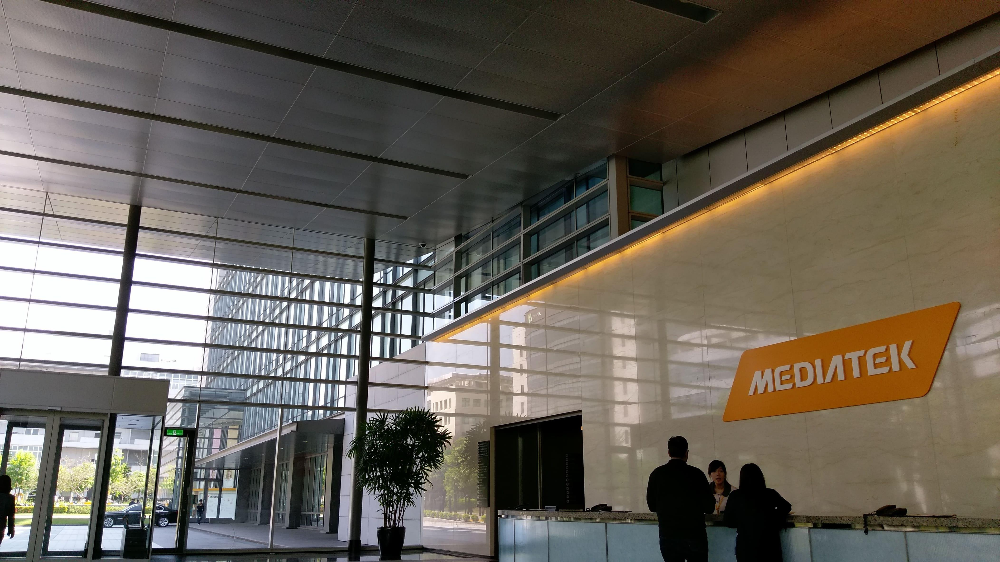

# 面試經歷：MTK 2018 暑期實習 多媒體演算法開發

早上10:40 左右到台北車站，排了 10mins 左右 11:00 買到自由座的票。早早在車上把午餐解決了。12點多就到聯發科總部了。

## 過程

一開始部門經理會先介紹現在在做些什麼，然後請我做自我介紹＋大學經歷。氣氛是輕鬆的。

## 結果

我先介紹大學上過的課，還有在 HackNTU 上和同學一起做的專案。因為 HackNTU 的專案太小，所以又要介紹一個自己認為做的「好」的專題。

這裏就炸了，我直接講上學期我做的期末專題：實作一個論文的演算法，那個我也只有停留在實作，優化的對象和方法雖然清楚，實驗和數據都還不算做的很好，沒有辦法表達很清楚，再加上臨場組織，表達一整個混亂。

假如說去年在中研院做的主題，可能還不會炸，畢竟至少還算是有數據和自己做的實驗結果和結論。

## 結論

絕對不要相信臨場不會記憶力、表達力下降 ，就這個職位對要實習的學生來講，需要準備的投影片就是大學＋碩士歷程，再加上兩～三個自己做過的專案。對我這種臨時組織不了的人，專案絕對是要準備到細節，像是在備註裡面擺好講稿。兩三個的專案應該是可以自己選擇，不會當場指定。