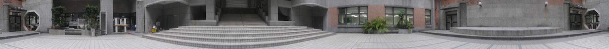

# 碩一下總結

碩 士一年級結束！接下來就是要把碩論弄出來的一年了！

## 課程

有日文下、 VFX 和 數值方法。

### 日文下

上完日文下後再努力一些應該是可以去考 N4 。

### VFX

一個很扎實的數位視覺效果課程，主要有三個作業，HDR、360Image 和 VFX Video 外加一個期末作業。

#### 360 Image

照一圈照片後，計算照片的相對位置，然後混色合併。

### 數值方法

也是很不錯的課程，會從浮點數開始介紹，到線性系統、非線性系統求解、最佳化、函數逼近 ... 等。我有寫[筆記](https://github.com/mudream4869/numerical-methods-notes)。

## 研究

目前大概是步上正軌了，不知道年底的 Conference 有沒有機會趕上。