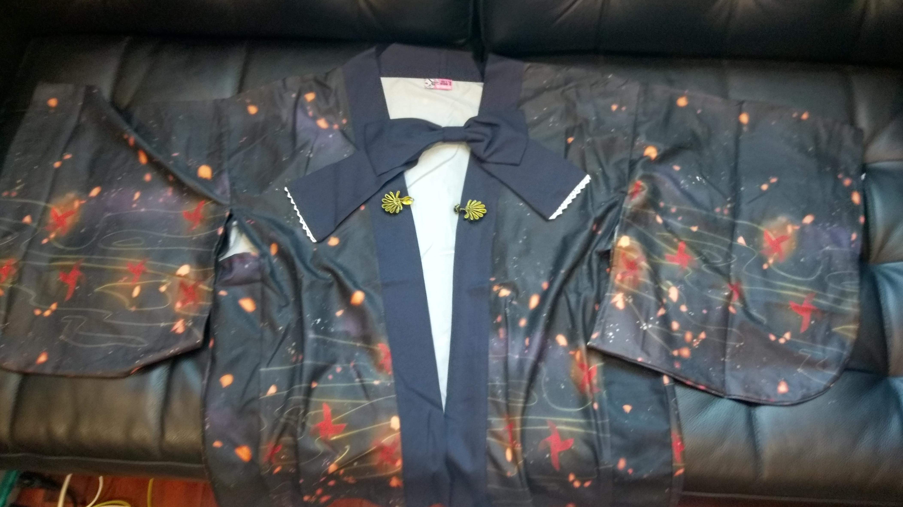
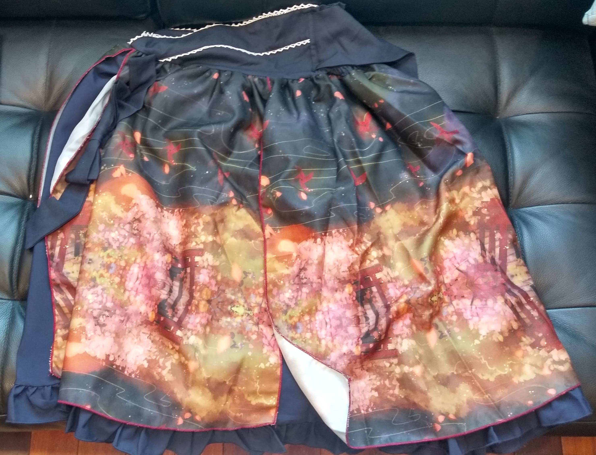
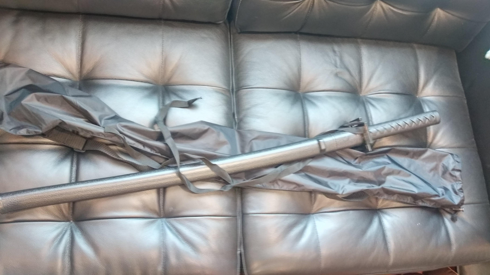
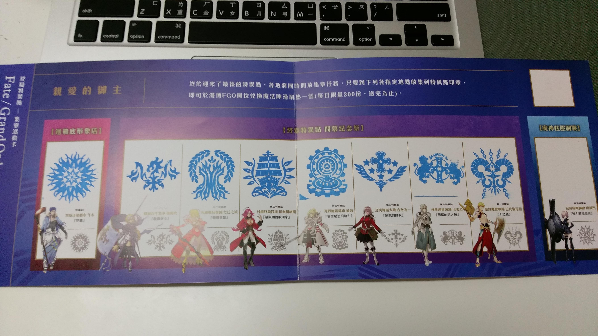
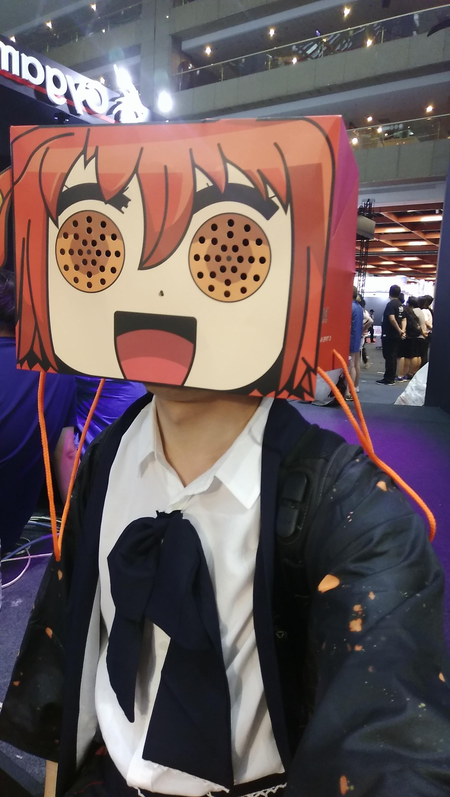

# 2018 漫畫博覽會

## 穿著

前幾天在網路上看到這個羽織半裙

，覺得很可愛，並且可能滿符合「我」的感覺，就買下來去漫博穿。中途還被人以為是 COS 😂。

## 戰利品

最近基本上沒有在看動畫，只是以前沒參加過這樣的活動，來沾沾氣氛，所以也只是逛逛，戰利品 ... 就一把塑膠日本刀，根據店員，這其實可以拿來對練。

### 塑膠刀

## 攤位

### FGO

我並不是之前就有入坑 FGO ， Fate 系列的我也就只有完整的把 Fate/Zero 看完，剩下有關型月和冠位指定的設定，全看同人小說補完（同人小說真的很多很多）。

由於需要是有登記的玩家才可以領到一些東西，我才在當天入坑。並且領到了一張集章卡

和咕噠子紙袋。

對，紙袋是可以戴在頭上的。

集章卡除了第一個章，剩下五個章都可以在展場裡面拿到。

### 虛擬實境遊戲機

玩了三個遊戲，前兩個是主角不需要移動（開槍打恐龍和騎馬），都還滿適應的，可是第三個，開一個太空船，就很暈。

不太確定是因為玩前面幾個沒休息，還是因為自己真的不太適應就是 ...

## 晚上

晚上和在 FB 認識的網友吃飯，他們都是北上在漫展打工的。