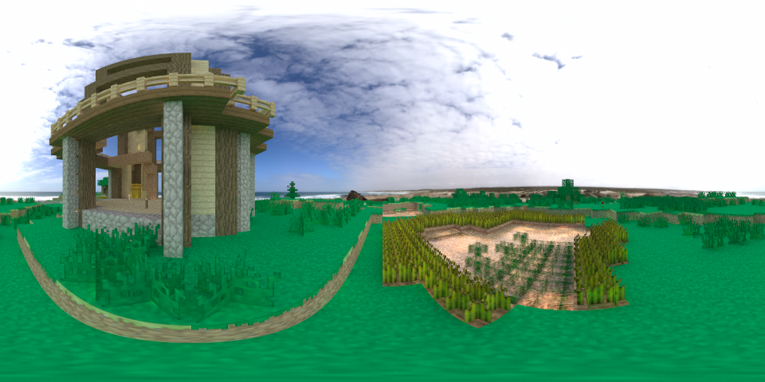

# PbrtCraft 用 pbrt 畫 Minecraft 遊戲場景

這是一個在學期中忽然有要做的專案：把 Minecraft 的遊戲畫面用基於物理方式，像是光線追蹤或光子映射的方式畫出來。

我已經先在 Github 上開了 [PbrtCraft](https://github.com/PbrtCraft) 。

## 流程

我目前弄的 Pipeline 就是先讀取 Minecraft 的地圖檔案，生成場景描述，然後送到 pbrt-v2 畫。

### 讀取 Minecraft

直接用 [PyAnvilEditor](https://github.com/DonoA/PyAnvilEditor)來讀取。

### 生成場景描述

這裡就會需要取得到 Minecraft 的資源包，資源包有兩部分，第一部分是描述模型，第二部分則是所有貼圖。

### pbrt-v2

針對原本的 pbrt-v2 ，為了能夠方便渲染 Minecraft 場景，我做了以下調整：

* Texture Sampling 改用 Neareast Neighbor
* 新增 Shape : Quad
* Image Material 增加 Tint Spectrum 屬性
* 增加讀取 PNG 的 RGBA

## 目前成果

天空 HDR 來自 [HDRI Haven](https://hdrihaven.com/hdris/)

畫面來自 Minecraft 1.13 ，右邊半透明的是水。

## 接下來？

仍然有不少事情等著，像是 Volume ，除了水暫時當作玻璃，其餘如火、岩漿等，我並沒有寫進場景描述。

生物，包含 NPC 、怪物以及一般生物，目前還並沒有讀取並且畫出來，這需要讀取地圖上生物的位置資訊以及他們的模型。

光源，例如火把、南瓜燈 ... 等，假如需要符合 Minecraft 的模型，卻又有不錯的渲染效果，那可能需要寫一些不太符合物理性質的光源，像是不會直射眼睛，但卻會影響周遭。

pbrt 部分改用 pbrt-v3 ，這樣就可以用到更新過的 OpenEXR 和使用 sppm 渲染。

增加一個 GUI ，讓一般玩家也可以輕易操作，目前考慮是用 Tornado 架 Server ，這樣一些開 Server 的也可以用這個來畫場景。