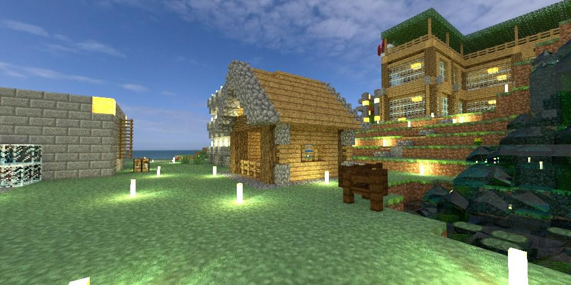

# 碩二上總結

讀碩的時間過得也算滿快的，一下子就要開始寫碩論準備找工作了。

## 課程

### 數位影像處理

這門課從基礎的影像處理，講到傅立葉變換、編碼、去噪 ... 等，想要打基礎，這門課絕對是首選。不過為什麼期末專題是會用 CycleGAN 來做啊 ...

總之期中考還有期末專題結果還算不錯。

### 感知運算

課程偏向影像檢索，主要是在講特徵，像是 Global、Local、SIFT、 Facial: LBP ... 等，老師期望從以前的發展讓學生對近幾年來開始發展的 CNN 有一定的想法。

## 其他

### 碩論

這學期已經把一些材料準備好了，寒假決定好題目後就要開始寫了。

### 日文 N5

由於這學期事情有點卡，所以最後是決定先考 N5 ，也過了，算是對去年上了一年日文課的一些交待。

### TA

大概就是要負責出功課、打分，準備一部份期中考題。下學期因為要忙碩論，大概不會繼續當助教。

### PbrtCraft

這是一個學期中忽然想做的專案，主要是讀取 Minecraft 的場景，然後用光線追蹤法（或其他基於物理的方式）畫出來。

這會開一系列的[進度文](/blog/2019-01-12/pbrtcraft-episode-1/)。

這是目前的進度：

