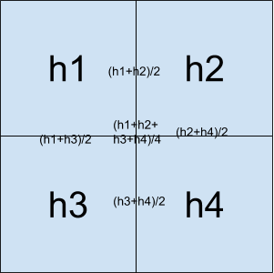
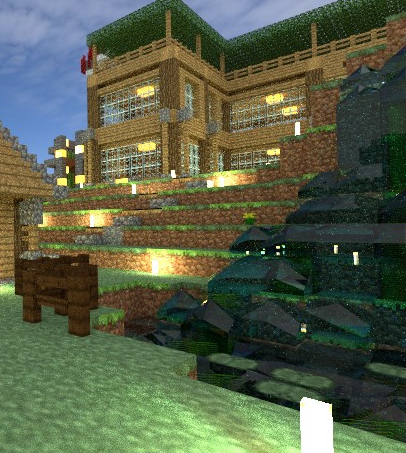

# PbrtCraft 進度二

[點我到上一次進度](/blog/2019-01-12/pbrtcraft-episode-1/)

這一次進度包含物理、讀檔還有一些讓 Code 更好維護。

## Pbrt-v3

我直接把之前的東西移到 pbrt-v3 了。好處不少，至少 OpenEXR 的版本比 pbrt-v2 的新了，也有 Stochastic Progressive Photon Mapping 。

## 物理

### 水

這次的進度並沒有去模擬流體，只有做一點針對高度的一點平滑化的處理，還有物理性質的設定。

一個水塊會用一個 3x3 的 HeightField 表示，中間的高度是這方格水本身的高度，旁邊八個則是和旁邊的方塊做內差。



物理性質則是把折射率調成 1.33 ，穿透光譜則設成偏藍色。

Pbrt-v3 部分，我只把原本 Heightfield 吃的 Z 軸改成 Y 軸。

### 發光體

直接把 Texture 當作一種光源。這裡一點小細節是我把火把的亮度抬高 8 倍，因為火把的表面積比一班方塊小很多。

由於 Pbrt-v3 的 diffuse area light 只提供純色發光面，所以我根據 `diffuse.cpp` 改寫出一個 [texlight.cpp](https://github.com/PbrtCraft/pbrt-v3-minecraft/blob/master/src/lights/texlight.cpp) 。

### Biome

Minecraft 的生態域顏色是寫死的，可以直接參照 [Mineway/biomes.cpp](https://github.com/erich666/Mineways/blob/master/Win/biomes.cpp) 改寫。

### Result



## 讀取

### 玩家

主要是要自動讀取玩家當前的位置還有眼睛方向，設定檔裡面會提供座標還有眼睛的經緯度，很容易就可以轉換成 Pbrt 吃的 Lookat Vector 。

看的方向可以直接用經緯度轉球座標，而頭頂向量則是用緯度+90度來算。

### 資源

自動找到 minecraft 的 jar 檔，然後把資源解壓縮出來。 Python 這方面還真是方便，向自動把使用者的環境參數，建立暫存檔等 ...

## 整理

因為算是一個進度了，所以我打算整理一下整個專案。畢竟之前都是以目的為主，結果漂亮就可以接受。但假如繼續開發下去，整個程式碼只會越來越亂。

### Pylint

這個程式可以指出 python script 哪些地方有問題，例如：

* 多出的空白
* 逗號後面有沒有空格
* Class, Function 有沒有 docstring

等，然後還會給出一個評分。

### Python Structure

參考[這篇](https://github.com/realpython/python-guide/blob/master/docs/writing/structure.rst)對專案的檔案結構做出一些改變。

### 材質

我把材質的部分獨立出來成為一些 Class 。主要好處之後比較容易增加指定材質。

例如玻璃，只要之後在使用時呼叫 `write` ，便可以指定玻璃材質。

```python
class Glass:
    def __init__(self, block):
        self.block = block

    def write(self, fout, face):
        tex = face["texture"]
        fout.write('Material "glass" "texture Kr" "%s-color"\n' % tex)
```