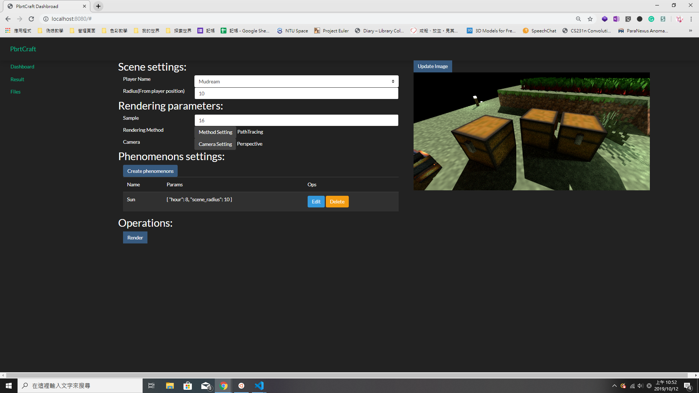

# Appier

在 2019 年下半年，我從碩班畢業，並且進了 Appier 。

這幾個月我基本上都在寫 Server 。和我以前不一樣的地方，出在了 Server 各方面的重要性質。而這是我以前都不會去注意到的，至少，我發現我以前寫的 Littale Code 品質實在糟。

Appier 的工作環境是很不錯的。

# Side Project

開始工作後，我開始不知道假日要做甚麼。以前大概都會想，繼續寫 Code 阿，打競賽之類，但在平常先把寫 code 精力耗掉了，假日又覺得假如寫其他東西，可能會影響到平時寫的效率，所以就不怎麼寫。

不過還是有些產量的，目前我主要會去維護 Pbrtcraft，這是我正在準備的 GUI:

# 健身房

在辦公室久坐，再加上平時並沒有運動的習慣，讓我在這下半年內已可見的趨勢增胖，臉部腹部腿部都可以看出來，不少之前喜歡的衣服因此穿不了。所以我在 12 月初開始去公司附近的一家健身房：健身工廠。

目前找了私人教練，至少希望身材可以回到一個比較好的狀態。

# Minecraft 直播

在去年八月，又重新開始直播 Minecraft 了，有時會是單機，有時會是連多人，有興趣的人可以來圍觀啊。

[帕秋莉是可愛男孩子 - Twitch](https://www.twitch.tv/patchyc)

# 新年新希望

- [隱藏] 對，這是秘密，希望可以達成，目前還在開坑中，填好了會發文的，提示：跟遊戲有關。
- 在健身後，** 可以更上一層樓。（這個熟人應該清楚是什麼）
- [隱藏] 😳 這是秘密~。

許三個願望大概就這些了，當然還有一些小計畫的，不過有懸念的才比較值得擺上來。