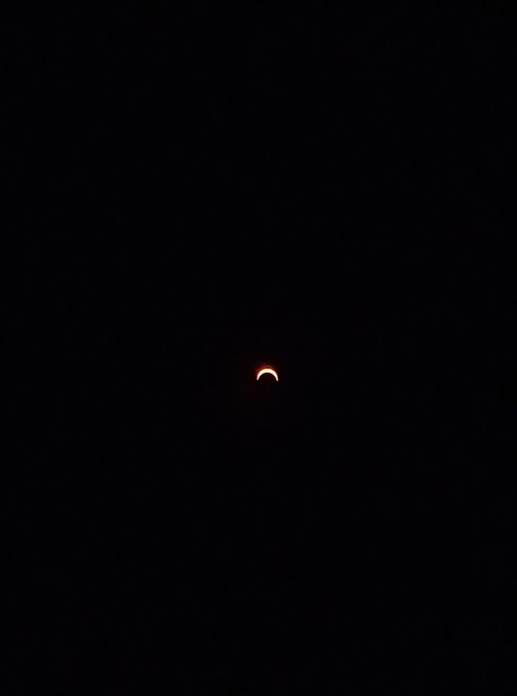

# 2020 年日環食

這次日環食是一百年來的唯一一次，下次要看要等一百多年之後。

## 觀察地點

在台灣要跑到嘉義附近才可以看到，在台北只能看到日偏蝕。

## 照片

我並沒有到有日環食的地方，例如嘉義，畢竟那天是星期天，一日遊的行程大概會弄的滿累的，而隔天又沒有休息，所以就將就在台北天文館觀測日偏蝕。

當天天文館就有發一個觀測太陽用的「扇子」。

手機的焦距和快門經過調整，透過扇子的觀測區，可以照到這樣的成果。

