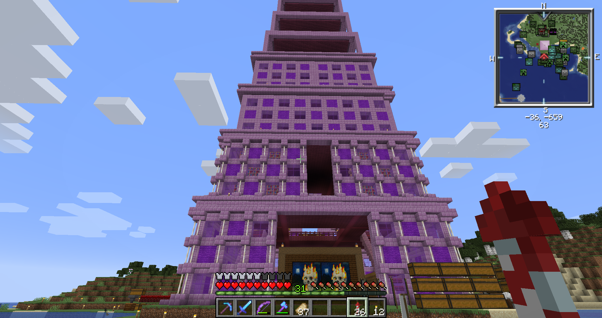

# 2020 回顧與新年希望

2020 年將近尾聲，是時候對這一年做點總結，並且準備下一年的目標了。

## Appier

在這間公司待超過一年了，也開始接觸到一些比較緊急的任務。

## 運動工廠

從去年年底開始，我每週至少會挑兩天中午去運動，避免一整天都坐在辦公室對身體健康造成的不良影響。

至少，身材有維持(心虛)。

## Minecraft Server

自架私服，和朋友一起遊玩 Minecraft 。

通天塔：

## Modern C++

今年 4, 5, 6 月，由組長指定一些問題，並且認識到如何寫 Modern C++。赫然發現原來我以前都不會 c++11 啊。

過程記錄在 Medium：[https://medium.com/@mudream4869](https://medium.com/@mudream4869)

- Way to C++: 1. Copy Constructor
- Way to C++: 2. Move
- Way to C++: 3. std::unique_ptr
- Way to C++: 4. Auto close (雜)
- Way to C++: 5. Forwarding Reference
- Way to C++: 6. Exception Safe
- C/C++ Memory Alignment

## ImgCity

對之前的 ImageCity 進行重構了，本來是寫成像是 Single Page Application，但這樣很難做 SEO ，所以乾脆還是用 python tornado 重寫了一遍，並且把 Deploy script 也擺了上去。

[https://github.com/mudream4869/imgcity](https://github.com/mudream4869/imgcity)

文章管理部分，我則是打算用 electron + vue + typescript + bootstrap + bootstrap-vue 重新寫一個。畢竟原本用的 Vuestrap 需要 retire 了，可以直接使用 Bootstrap 官方支持的 bootstrap-vue。

## Cablin

*cablin 是廣藿香的種小名。*

雖然這個計畫開始於今年十月左右，但其實以前就一直有這個想法。在 crpg 裡面，我是用 python 作為腳本語言，那時候天真的認為 Python 很容易很簡單，但後來遇到一些情況，讓我覺得可能還是要提供一個 GUI Scripting 的東西。

這就是 Cablin 誕生的理由，目前我有先實作一個 C++ 的 Cablin Interpreter，開發者也可以在裡面加入他所需要的指令。

之後等 GUI 做好後會再做一個比較細的介紹。

[https://github.com/mudream4869/cablin](https://github.com/mudream4869/cablin)

## 2021 年預計 ...?

### Cablin

主要是寫一個 Example GUI。畢竟宣稱 GUI Scripting Language ，那就要有個 Example，否則說服不了人。

更進一步的話，可能還會弄個線上 Judge。

### 解謎小遊戲

其實在 2020 年就有先嘗試一下目前的世界觀，有個遊玩時間大概十分鐘的 Prototype，但目前卡在在寫完整的故事腳本以及如何呈現，細節就先保密~

### 保密

😛保密~