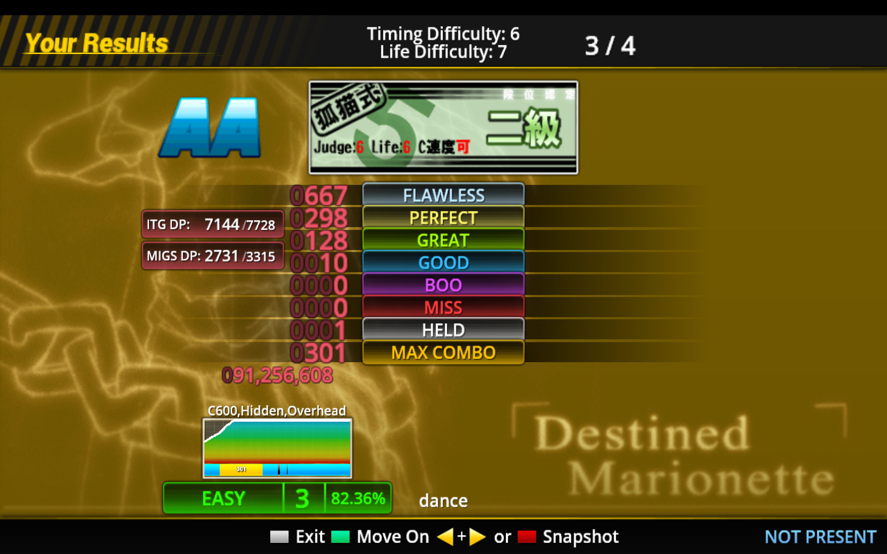

# Mudream

## 自我介紹

有一陣子常常在找恐怖RPG玩。

常看小說，因為有興趣的主題且完本的大多都看完了，然後又開始腦洞一些劇情，所以有在寫小說。

* 暱稱：Mudream、姆Q

* 目前狀態：自戀、崩潰、為了認清自己而努力中

* 喜歡：數論、Coding、Stepmania、百合、偽百合、帕秋莉、恐怖RPG、VR/AR

* 討厭：機率

## 可以在哪裡找到我？

[Github](https://github.com/mudream4869)
[Twitter](https://twitter.com/mudream4869)

## 技能

### 程式語言

|程式語言    | 程度  | 概略描述 |
|------------|-------|----------|
| C          | ★★★☆☆ ||
| C++11      | ★★★☆☆ | 寫過一個RPG遊戲引擎  |
| Python     | ★★★☆☆ | 主要是用來架設Server |
| HTML       | ★★☆☆☆ ||  
| Javascript | ★★☆☆☆ || 
| SQL        | ★☆☆☆☆ | 簡易的CRUD |
| Ruby       | ★☆☆☆☆ | 寫過一個簡易的書櫃 |

#### 常用工具

* 架設網站 : Python3+Tornado+Nginx+PostgreSQL

#### Stepmania

狐貓二級

